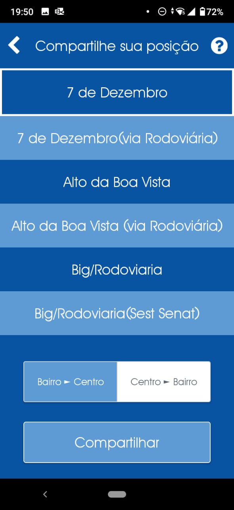

# Buzee

Buzee was the first mobile app I ever built and it is by far the <b>largest</b>. It had many features and the startup built around it was incubated and received many prizes.

Buzee was a "Waze for buses". The idea was that people could share their live location anonymously while riding a bus, thus letting other people know where the bus was and how long it would take to reach each bus stop along the line.

We built a community around it so people actually shared their location, rated services and could report several events that could cause delays, for example.

The project was cancelled after about a year of existence since we had trouble monetizing it and we were working full time.

> :exclamation: Since this app was built for commercial use, the repository is private. Ask me if you want to checkout the code.

### :fire: Features

- Live location sharing with other users
- Anonymous forum where people could talk during transit/get informed about situations
- Traffic reporting (flat tires, broken buses, heavy traffic...)
- Gamification and coupon rewards for being an active member of the community
- Onboarding to explain the app, since it was fairly extensive
- Up to date arrival times, with less than 5 minutes margin of error anywhere in the city

### :computer: Technologies used

- React Native
- Firebase (Auth, Database, Crashlytics, Functions)

### :busts_in_silhouette: Team

<ul>
  <li>Founders</li>
  <ul>
    <li> <a href='https://linkedin.com/in/thaleskenne'>Thales Kenne</a> - Full Stack, Head </li>
    <li><a href='https://linkedin.com/in/almazzorani'>Alisson Mazzorani</a> - Design </li>
    <li><a href='https://linkedin.com/in/andreimatiazi/'>Andrei Matiazi</a> - Backend </li>
  </ul>
  <li>Interns</li>
  <ul>
    <li><a href='https://linkedin.com/in/gvcaetano/'>Gabriel Caetano</a> - Web </li> 
    <li><a href='https://linkedin.com/in/davi-calil-17554111b/'>Davi Calil</a> - Hardware design </li> 
    <li><a href='https://linkedin.com/in/clariblanco/'>Clari Blanco</a> - Marketing </li> 
    <li><a href='https://linkedin.com/in/déborahundertmarck/'>Débora Hundertmarck </a> - Marketing </li> 
    <li><a href='https://linkedin.com/in/liany-avila-a9b4bb140/'>Liany Ávila</a> - Marketing </li> 
  </ul>

</ul>

### :trophy: Prizes

- First place at Desafio i9 2018, an entrepreneurship competition.
- Second place at Desafio do Varejo 2018, an entrepreneurship competition.
- Finalist at Renault Experience 2018, an entrepreneurship competition with focus on mobility
- Incubation at the Federal University of Santa Maria

### :camera: Preview

<table>
  <tr>
    <td>Login screen</td>
     <td>Onboarding</td>
     <td>Main Screen</td>
  </tr>
  <tr>
    <td></td>
    <td></td>
    <td></td>
  </tr>
</table>

<table>
  <tr>
    <td>Side Menu</td>
     <td>Bus times at a stop</td>
     <td>Location share screen</td>
  </tr>
  <tr>
    <td></td>
    <td></td>
    <td></td>
  </tr>
</table>

<table>
  <tr>
    <td>Profile Screen</td>
    <td>Forum</td>
  </tr>
  <tr>
    <td></td>
    <td></td>
  </tr>
</table>
